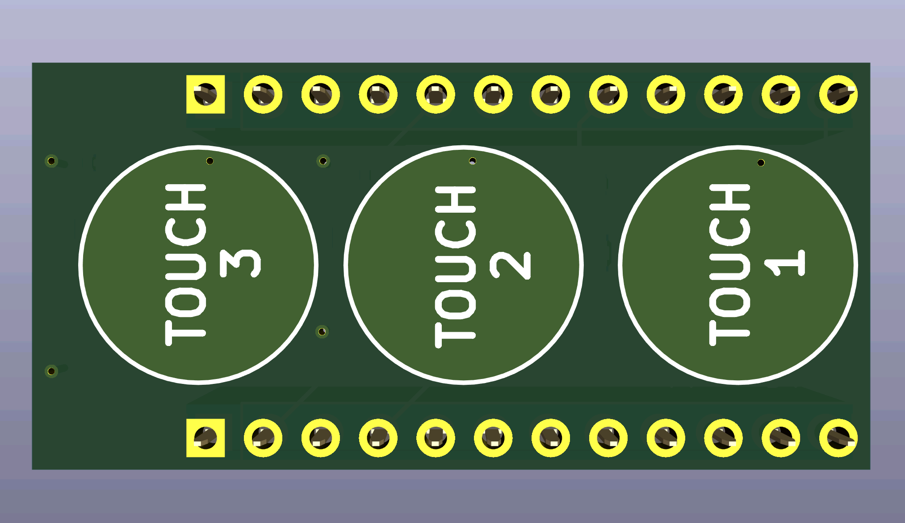

# NixOS

## Quick and dirty setup guide for testing

### Download and run a vm

```sh
# create a tmp folder
mkdir -p tmp

# download the current version of nixos
test ! -f tmp/nixos.iso && wget https://channels.nixos.org/nixos-24.11/latest-nixos-minimal-x86_64-linux.iso -O tmp/nixos.iso || echo "Nothing todo!"

# create the device for install the os
test ! -f tmp/nixos.img && qemu-img create -f raw tmp/nixos.img 70G || echo "Nothing todo!"
```

### Run the vm

```sh
# ---( Option A)--- #
# run the boot command with gui
qemu-system-x86_64 -enable-kvm -hda tmp/nixos.img -smp 8 -m 16G -nic user,hostfwd=tcp::8888-:22 -cdrom tmp/nixos.iso -boot d

#---( set a password to root in the vm )--- #
#~$ passwd
```

```sh
# ---( Option B)--- #
# run the boot command just in plain terminal
qemu-system-x86_64 -enable-kvm -hda tmp/nixos.img -smp 8 -m 16G -nic user,hostfwd=tcp::8888-:22 -cdrom tmp/nixos.iso -boot d -nographic -serial mon:stdio

#---( set a password to root in the vm )--- #
#~$ passwd
```

### Login to vm
```sh
ssh-keygen -f "/home/user/.ssh/known_hosts" -R "[127.0.0.1]:8888" && \
sshpass -p '12345' \
ssh -o StrictHostKeyChecking=no -o PreferredAuthentications=password nixos@127.0.0.1 -p 8888
```


## Arduino

> [!TIP]
> [Arduino Pro Micro (ATmega32U4)](https://www.amazon.de/EntwicklungBoards-Binghe-Mikrocontroller-Entwicklungsboard-Selbst-USB-Updater/dp/B0D69JLJ97) <br>
> [USB C Adapter](https://www.amazon.de/dp/B0BYK917NM)

---
### Circuit diagram

<a href="arduino/pic/.png"></a>
<a href="arduino/pic/.png"></a>

---
### PCB Design

<a href="arduino/pic/pcb-diagram.png"></a>
<a href="arduino/pic/pcb-front.png"></a>
<a href="arduino/pic/pcb-back.png"></a>

> [!NOTE]  
> You can go to [JLCPCB](https://jlcpcb.com) and upload the [files](arduino/pcb/touch-shield/production/) and be production ready

---
### Case

<a href="arduino/pic/case-print.png"></a>
<a href="arduino/3mf/arduino_case.scad"></a>


<!-- Hier könnte Ihre Werbung stehen -->
